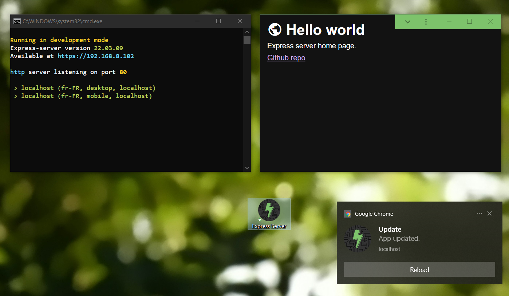

# Express Server

A template repo for quick express.js node server setup with:

-   Start npm script launching node with `sudo` (Linux).
-   Debug npm script launching nodemon (Windows).
-   HTTP and HTTPS servers on ports 80 and 443.
-   A dedicated SSL cert folder used by the HTTPS server.
-   A `route` function with basic express routage.
-   All desired express libraries and middelwares for `POST` requests JSON body, `useragent` and URL params.
-   Colored logs with duplication count suffix (e.g. `'Hello world x2'`).
-   A basic middleware providing:
    -   Lang/country based restrictions (e.g. `'en-US'` or `'N/A'`).
    -   Colored connexion logging.
-   A `debug.bat` script to quick-launch every needed apps for dev, including SCSS precompiler.
-   `tasks.json` and `launch.json` configs for on-start chrome debugging.
-   A basic manifest and service-worker
